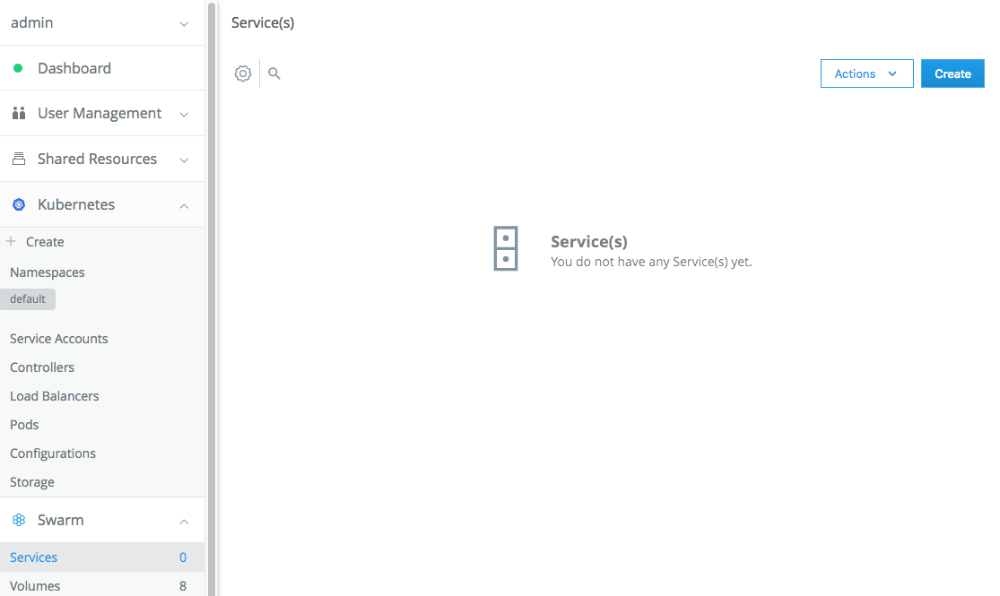
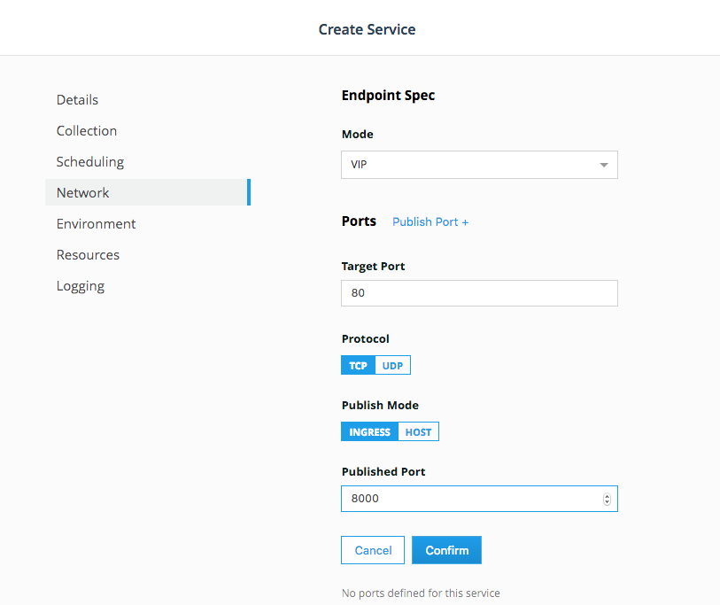
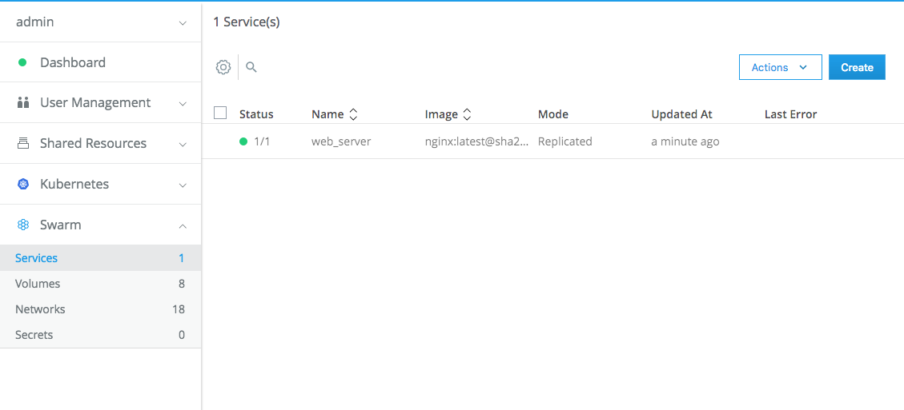
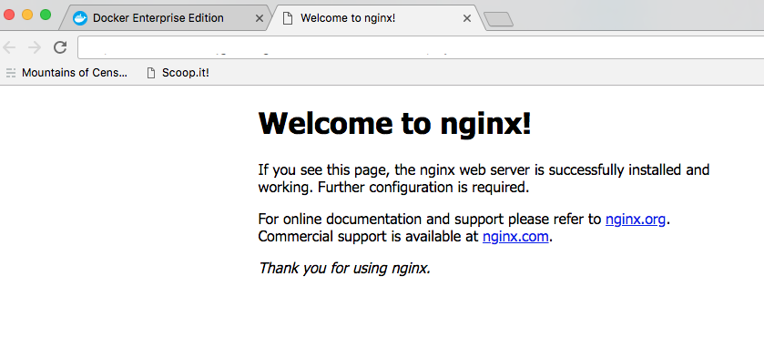
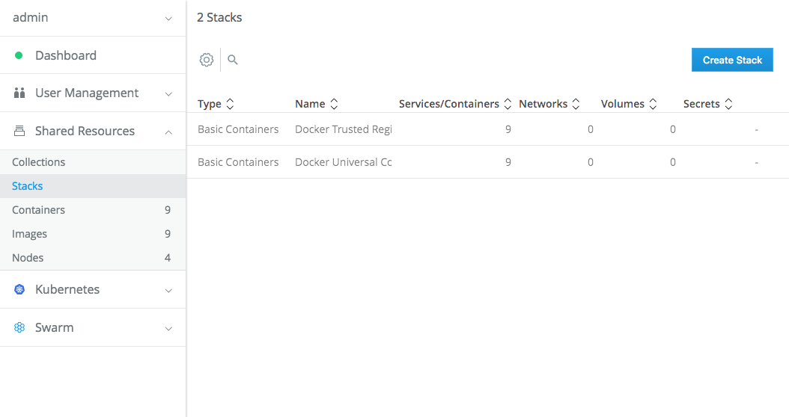
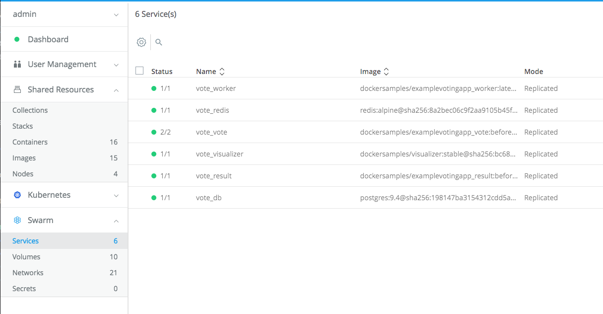
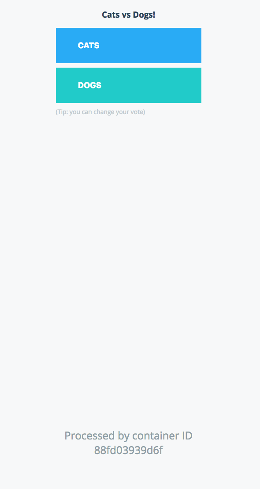
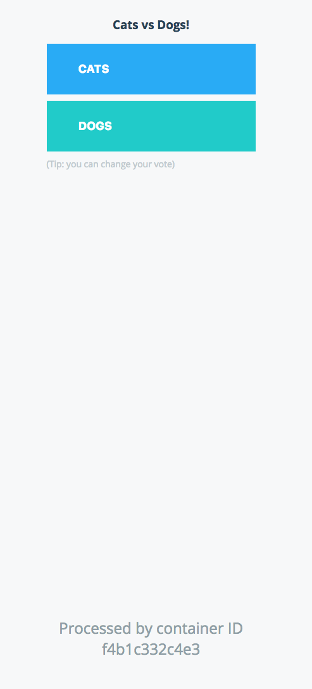
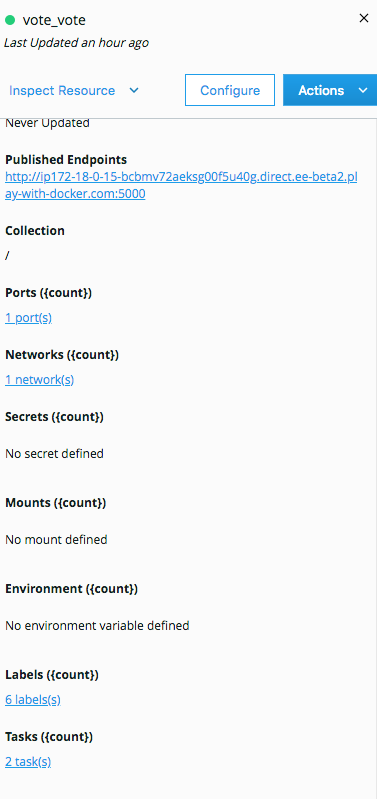

# Docker EE - Introduction
Docker Enterprise Edition is....


# Tasks
  * [Task 1: Launch a Web Server](#task1)
    * [Task 1.1: Accessing PWD](#task1.1)
    * [Task 1.2: Create an NGINX Service](#task1.2)
  * [Task 2: Create a Multi-Service Application](#task2)
  * [Next Steps](#next)

## <a name="task1"></a>Task One Launch a Web Server

### <a name="task1.1"></a> Task 1.1: Access Play with Docker environment
In order to run the lab, we have provided a Docker Enterprise Edition *Play with Docker* environment for you to use. This workshop is only available to people in doing a [Hands-on-Lab at DockerCon 2018](https://2018.dockercon.com/hands-on-labs/).

# TODO:Provide a link to the environment

When you open it, it'll look something like this


You won't be using the command line for this lab. If you want to explore that more, check out [the other labs](https://2018.dockercon.com/hands-on-labs/).

1. Navigate in your web browser to the URL provided to you.

2. Fill out the form, and click `submit`. You will then be redirected to the PWD environment.

	It may take a few minutes to provision out your PWD environment.

3. From the main PWD screen click the `UCP` button on the left side of the screen

	> **Note**: Because this is a lab-based install of Docker EE we are using the default self-signed certs. Because of this your browser may display a security warning. It is safe to click through this warning.
	>
	> In a production environment you would use certs from a trusted certificate authority and would not see this screen.
	>
	> 

4. When prompted enter your username and password (these can be found below the console window in the main PWD screen). The UCP web interface should load up in your web browser.

	> **Note**: Once the main UCP screen loads you'll notice there is a red warning bar displayed at the top of the UCP screen, this is an artifact of running in a lab environment. A UCP server configured for a production environment would not display this warning
	>
	> 

### <a name="task1.2"></a>Task 1.2: Create an NGINX Service

For this task you will create a service that runs an NGINX webserver. Just the default server, running the default web page. We're going to run it on Swarm.

1. Click on Swarm->Services and then `Create`.
  

2. Give the service a name like `web_server` and image `nginx`. Don't click `create` just yet. First click over to the `Network` tab.

3. On the `Network` tab, click `Publish Port` so we can expose a port people can use to view the website. Fill in the `Target Port` with 80, and the `Published Port` with `8000`. We're using `8000` in order to avoid conflicts with the app in [Task 2](#task2).
  

4. Click `Confirm` and then `Create`. This will pull the latest `nginx` image from [Docker Hub](https://hub.docker.com), and then deploy it as a service exposing port 8000, routing that to port 80 in the container. Normally you would want to pull your own image from [Docker Trusted Registry](https://docs.docker.com/ee/dtr/). You can try that out in one of the other labs.

5. Back on the `Services` tab, you will see that `web_server` is being created. It will have a red dot next to it while it pulls the image and then deploys it. Once it turns green, you will know it is ready.

  

6. Click on the service and you will see the configuration. Find the link to `Published Endpoints` and click on that.
  

7. This should open up the default NGINX web page.

  

8. If you feel like it, go back to the services tab and remove the `web_server` service.

## <a name="task2"></a>Create a Multi-Service Application

<a href="#task1">Task 1</a> was a great way to get started, but apps are rarely single service. You may have many services running. You could go through and create and configure each one, one-by-one. Or you could use a [Stack](https://docs.docker.com/get-started/part5/) to create the application all at once, with all the configuration you need. Docker EE makes this really easy.

1. Click on `Shared Resources` and then `Stacks`. Click on `Create Stack` in the upper right.

  

2. Name the stack `vote`, select `Swarm Services`, and paste the following compose file into the editor. Then click `Create` in the lower right.

  ```
  version: "3"
  services:

    redis:
      image: redis:alpine
      ports:
        - "6379"
      networks:
        - frontend
      deploy:
        replicas: 1
        update_config:
          parallelism: 2
          delay: 10s
        restart_policy:
          condition: on-failure
    db:
      image: postgres:9.4
      volumes:
        - db-data:/var/lib/postgresql/data
      networks:
        - backend
      deploy:
        placement:
          constraints: [node.role == manager]
    vote:
      image: dockersamples/examplevotingapp_vote:before
      ports:
        - 5000:80
      networks:
        - frontend
      depends_on:
        - redis
      deploy:
        replicas: 2
        update_config:
          parallelism: 2
        restart_policy:
          condition: on-failure
    result:
      image: dockersamples/examplevotingapp_result:before
      ports:
        - 5001:80
      networks:
        - backend
      depends_on:
        - db
      deploy:
        replicas: 1
        update_config:
          parallelism: 2
          delay: 10s
        restart_policy:
          condition: on-failure

    worker:
      image: dockersamples/examplevotingapp_worker
      networks:
        - frontend
        - backend
      deploy:
        mode: replicated
        replicas: 1
        labels: [APP=VOTING]
        restart_policy:
          condition: on-failure
          delay: 10s
          max_attempts: 3
          window: 120s
        placement:
          constraints: [node.role == manager]

  networks:
    frontend:
    backend:

  volumes:
    db-data:
  ```

3. This will start creating a multi-service voting app. It has several components, as you can see:

  `redis` a key value store to temporarily store votes
  `db` a PostGres database
  `vote` to collect votes
  `result` to display votes
  `worker` to collect votes from the `redis` service and put them into the database

4. Creating the stack also creates a couple of networks and scales the vote service to 2 replicas, which will spread it out over two containers. Given different [distribution strategies](https://docs.docker.com/docker-cloud/apps/stack-yaml-reference/#deployment_strategy), this could spread it to one or two nodes.

5. After you click create, it will take a little while to get started. Each service will be created. If you click back on `Stacks` you will see `vote` there.

  

6. Click over to `Swarm` and then `Services` and you'll see the services gradually turn green.

  

7. If you click on `vote_vote` you can select the endpoint and click to see the voting app.

  

  You'll see the container ID at the bottom. That will change depending on the container and is randomly generated when the container is generated. If you hit refresh, you'll see the second service. Docker EE automatically load-balances between them.

  

8. Go back to UCP. Make sure `vote_vote` is selected, and scroll down the right panel until you see a link for `2 task(s)`. Click on that.

  

9. Each task is one container. You'll see taht they are spread over two of the worker nodes. Docker EE did that automatically based on the default distribution strategy.

## <a name="next"></a> Next Steps

While you have Docker EE open, check out various tabs and experiment, find out what you can. And, now that you've explored the basics of Docker EE, you can check out other [hands-on labs](https://2018.dockercon.com/hands-on-labs/), learning more about specific features of Docker EE. And finally, after DockerCon if you want to try out more Docker EE or suggest it to your colleagues, you can get a [12 hour hosted trial](https://trial.docker.com).