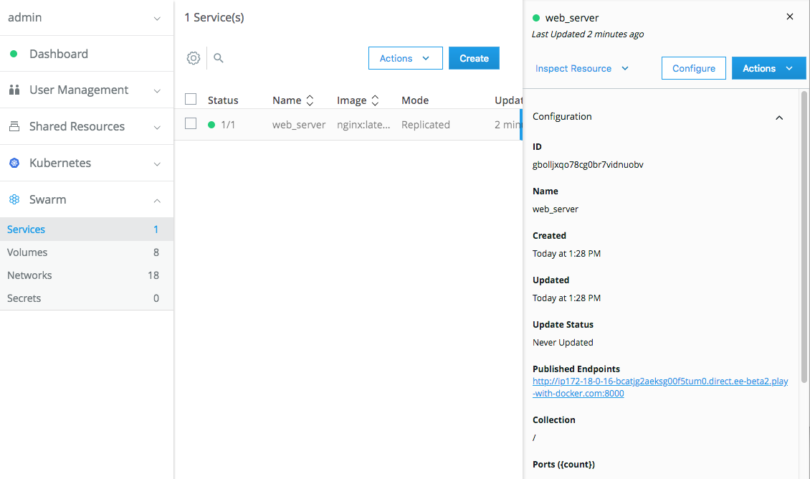

# Docker EE - Introduction
Docker Enterprise Edition is....

# Tasks
  * [Task 1: Launch a Web Server](#task1)
    * [Task 1.1: Accessing PWD](#task1.1)
    * [Task 1.2: Create an NGINX Service](#task1.2)
  * [Task 2: Create a Multi-Service Application](#task2)

## Task One Launch a Web Server

###  Task 1.1: Access Play with Docker environment
In order to run the lab, we have provided a Docker Enterprise Edition *Play with Docker* environment for you to use. This workshop is only available to people in doing a [Hands-on-Lab at DockerCon 2018](https://2018.dockercon.com/hands-on-labs/).

# TODO:Provide a link to the environment

When you open it, it'll look something like this

You won't be using the command line for this lab. If you want to explore that more, check out [the other labs](https://2018.dockercon.com/hands-on-labs/).

1. Navigate in your web browser to the URL provided to you.

2. Fill out the form, and click `submit`. You will then be redirected to the PWD environment.

	It may take a few minutes to provision out your PWD environment.

3. From the main PWD screen click the `UCP` button on the left side of the screen

	> **Note**: Because this is a lab-based install of Docker EE we are using the default self-signed certs. Because of this your browser may display a security warning. It is safe to click through this warning.
	>
	> In a production environment you would use certs from a trusted certificate authority and would not see this screen.
	>
	> 

4. When prompted enter your username and password (these can be found below the console window in the main PWD screen). The UCP web interface should load up in your web browser.

	> **Note**: Once the main UCP screen loads you'll notice there is a red warning bar displayed at the top of the UCP screen, this is an artifact of running in a lab environment. A UCP server configured for a production environment would not display this warning
	>
	> 

### Task 1.2: Create an NGINX Service

For this task you will create a service that runs an NGINX webserver. Just the default server, running the default web page. We're going to run it on Swarm.

1. Click on Swarm->Services and then `Create`.
  

2. Give the service a name like `web_server` and image `nginx`. Don't click `create` just yet. First click over to the `Network` tab.

3. On the `Network` tab, click `Publish Port` so we can expose a port people can use to view the website. Fill in the `Target Port` with 80, and the `Published Port` with `8000`. We're using `8000` in order to avoid conflicts with the app in [Task 2](#task2).
  

4. Click `Confirm` and then `Create`. This will pull the latest `nginx` image from [Docker Hub](https://hub.docker.com), and then deploy it as a service exposing port 8000, routing that to port 80 in the container. Normally you would want to pull your own image from [Docker Trusted Registry](https://docs.docker.com/ee/dtr/). You can try that out in one of the other labs.

5. Back on the `Services` tab, you will see that `web_server` is being created. It will have a red dot next to it while it pulls the image and then deploys it. Once it turns green, you will know it is ready.

  

6. Click on the service and you will see the configuration. Find the link to `Published Endpoints` and click on that.
  

7. This should open up the default NGINX web page.

  

8. If you feel like it, go back to the services tab and remove the `web_server` service.

## Create a Multi-Service Application
